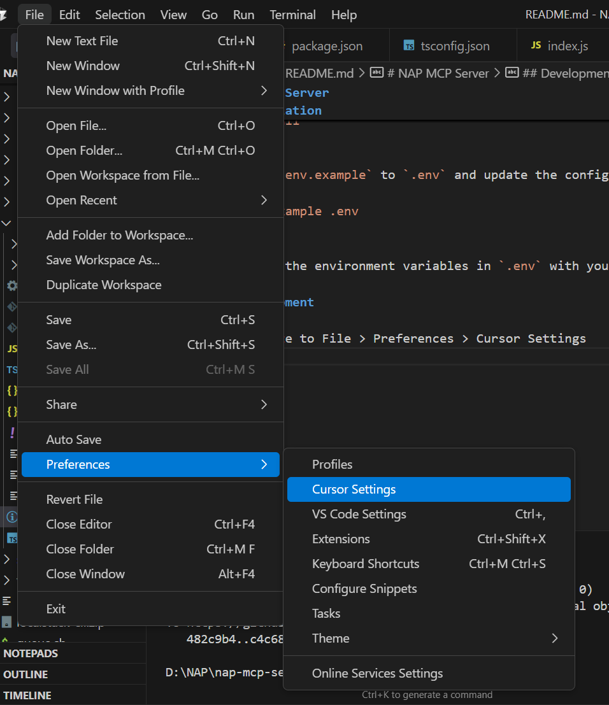
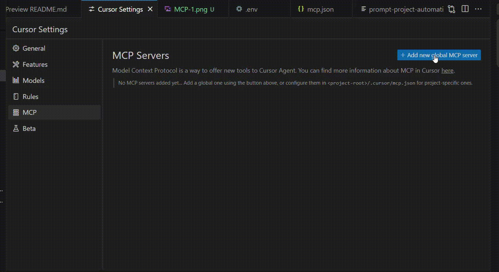

# NAP MCP Server

This is a Model Context Protocol (MCP) server implementation for the NAP API. It provides a standardized way to interact with NAP API endpoints through MCP tools and resources - through prompts

## Features

- Create Project, Add Applications, Add Clients & Create Workflows through MCP.
- Export Workflows from a project & Add to different Project (Import/Export Workflows).
- Create Workflows for a project using Prompts.

## Installation

1. Clone the repository
2. Install dependencies:
```bash
pnpm install
```

3. Copy `.env.example` to `.env` and update the configuration:
```bash
cp .env.example .env
```

4. Update the environment variables in `.env` with your NAP API configuration.

## Development

1. Navigate to File > Preferences > Cursor Settings


2. Navigate to MCP and create a new Server

3. In the config, Paste the following:

```
"nap-mcp-server": {
      "command": "node",
      "args": ["./nap-mcp-server/index.js"]
    }
```



--------------

Note: The server contains path to the index.js file, so if any changes are made by dev, make sure to run ``` npx tsc``` to compile the javascript code

## Common Usage

Below Video Demonstrates how to develop using MCP:

1. Import/Export Project:
--> Utilize the prompts mentioned in ```prompt-replicate-workflows.txt``` and edit the prompt based on the your requirements.

2. Make sure Agent mode is enabled (if not available, update cursor)


